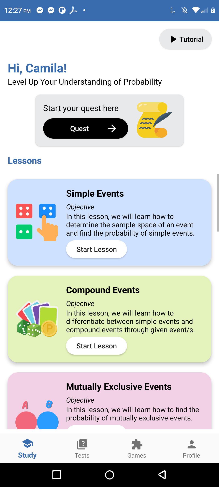
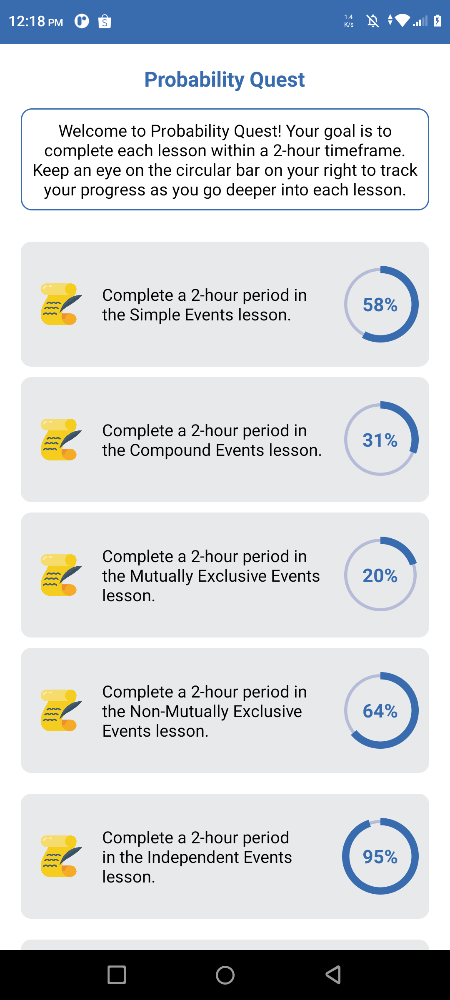
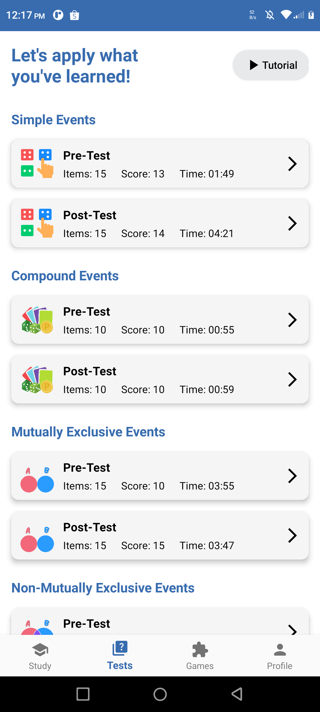
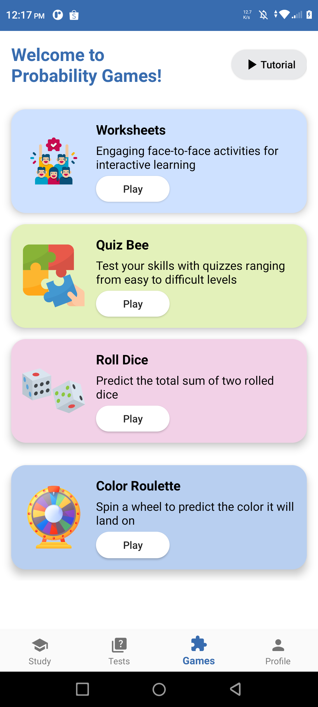
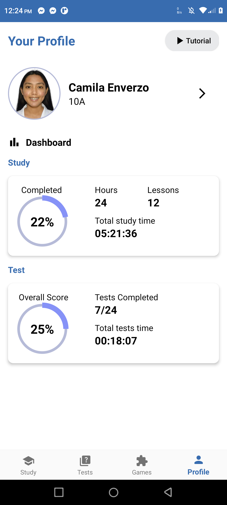

# *PROBQUEST*: A Mobile Application for Junior High School Probability Education

## Features

- *Interactive Lessons*: Detailed explanations of key probability concepts such as probability rules, events, and outcomes.
- *Quizzes and Assessments*: Multiple-choice quizzes and assessments to test students' understanding of probability.
- *Games*: Interactive games that reinforce key probability concepts. It includes worksheets, quizzes, and interactive simulations.
- *User Profile*: Edit user profile by creating profile picture, name, and section.
- *Dashboard*: Tracks learning progress by monitoring time spent studying and the overall score.
- *User-friendly Interface*: Simple and intuitive design to enhance user experience.
- *Offline Mode*: Content is accessible without the need for an internet connection.

## Screenshots

  
  
  

  
  
  

## Contact

- *Author*: Camila Enverzo
- *Email*: camilaenverzo12@gmail.com
- *LinkedIn*: linkedin.com/in/camila-enverzo/
  
## Acknowledgments

- Special thanks to Pangasinan State University – Urdaneta City Campus for their support.
- Gratitude to my adviser, critic reader, panelist, and instructors who contributed to the project's success.
 
